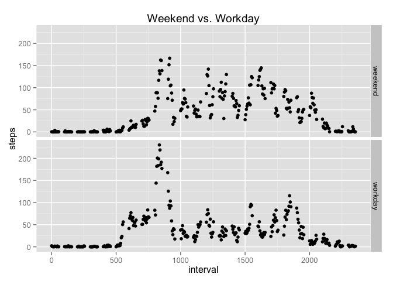

Coursera, Reproducible Research, Assignment 1
========================================================

## Loading and preprocessing the data


```r
library(plyr)
dataset <- read.table("activity.csv", header = TRUE, sep = ",", na.strings = "NA")
datasetC <- dataset # clean version for the third batch
dataset <- na.omit(dataset)
```

## Assignment
### What is mean total number of steps taken per day?

For this part of the assignment, you can ignore the missing values in the dataset.

1. Make a histogram of the total number of steps taken each day
2. Calculate and report the mean and median total number of steps taken per day


```r
#1-Histogram
dsHist <- aggregate(dataset$steps, by =list(dataset$date), FUN="sum")
colnames(dsHist) <- c("date", "steps")
hist(dsHist$steps, main = "Histogram of total steps per day")
```

 

```r
#2-mean, median
Omean <- mean(dsHist$steps)
Omedian <- median(dsHist$steps)
```

The mean of total number of steps taken per day is 1.0766189\times 10^{4}, and median is 10765.

### What is the average daily activity pattern?

1. Make a time series plot (i.e. type = "l") of the 5-minute interval (x-axis) and the average number of steps taken, averaged across all days (y-axis)
2. Which 5-minute interval, on average across all the days in the dataset, contains the maximum number of steps?


```r
#1 plot
dsAvg <- aggregate(dataset$steps, by =list(dataset$interval), FUN="mean")
colnames(dsAvg) <- c("interval", "steps")
plot(dsAvg, type='l')
```

 


```r
#2 max per interval
dsAvgMax <- arrange(dsAvg, -steps)
dsAvgMaxValue <- round(dsAvgMax[1,2],2)
dsAvgMaxInterval <- dsAvgMax[1,1]
```

The 835-interval has the maximum number of average steps (206.17).

### Imputing missing values
Note that there are a number of days/intervals where there are missing values (coded as NA). The presence of missing days may introduce bias into some calculations or summaries of the data.

1. Calculate and report the total number of missing values in the dataset (i.e. the total number of rows with NAs)

2. Devise a strategy for filling in all of the missing values in the dataset. The strategy does not need to be sophisticated. For example, you could use the mean/median for that day, or the mean for that 5-minute interval, etc.

3. Create a new dataset that is equal to the original dataset but with the missing data filled in.

4. Make a histogram of the total number of steps taken each day and Calculate and report the mean and median total number of steps taken per day. Do these values differ from the estimates from the first part of the assignment? What is the impact of imputing missing data on the estimates of the total daily number of steps?


```r
#1
NoNAa <- nrow(datasetC) - nrow(dataset)
#2 and 3
impute.mean <- function(x) replace(x, is.na(x), mean(x, na.rm = TRUE))
dat <- ddply(datasetC, "interval", transform, steps = impute.mean(steps))
#4
dsHist1 <- aggregate(dat$steps, by =list(dat$date), FUN="sum")
colnames(dsHist1) <- c("date", "steps")
OuMean <- mean(dsHist1$steps)
OuMedian <- median(dsHist1$steps)
hist(dsHist1$steps, main = "Histogram of total steps per day, part 2")
```

 

The mean of total number of steps taken per day is 1.0766189\times 10^{4}, whereby the median is 1.0766189\times 10^{4}.


### Are there differences in activity patterns between weekdays and weekends?
For this part the weekdays() function may be of some help here. Use the dataset with the filled-in missing values for this part.

1. Create a new factor variable in the dataset with two levels – “weekday” and “weekend” indicating whether a given date is a weekday or weekend day.
2. Make a panel plot containing a time series plot (i.e. type = "l") of the 5-minute interval (x-axis) and the average number of steps taken, averaged across all weekday days or weekend days (y-axis). See the README file in the GitHub repository to see an example of what this plot should look like using simulated data.


```r
dat$class <- ifelse((weekdays(as.Date(dat$date), abbreviate=TRUE) %in% c("sob","ned", "Sat", "Sun") ),"weekend","workday")
datWD <- subset(dat, class == "workday")
datWE <- subset(dat, class == "weekend")

dsHistWD <- aggregate(datWD$steps, by =list(datWD$interval), FUN="mean")
colnames(dsHistWD) <- c("interval", "steps")
dsHistWE <- aggregate(datWE$steps, by =list(datWE$interval), FUN="mean")
colnames(dsHistWE) <- c("interval", "steps")

library(ggplot2)
dsHistWD$class <- "workday"
dsHistWE$class <- "weekend"
dsHistAll <- rbind(dsHistWD, dsHistWE)
qplot(interval, steps, data=dsHistAll, facets = class~., main="Weekend vs. Workday")
```

 
